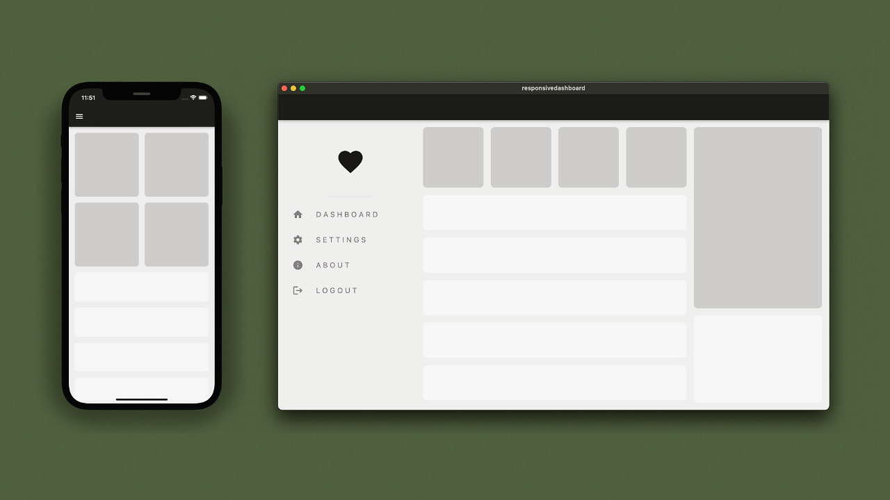

# responsive_dashboard_starter_project

Our goal is to build a simple dashboard UI that displays it's content with respect to it's screen size and aspect ratio.

## Our Goal

## Getting Started

This dashboard UI is configured to work on 3 types of screens.

- Mobile

- Tablet

- Desktop

## Prerequisites

- Flutter SDK

- Android Studio

- VS Code

## Installing

- Clone the repository

- Open the project in Android Studio or Visual Studio Code

- Run the project

## Built With

- Flutter

- Dart
